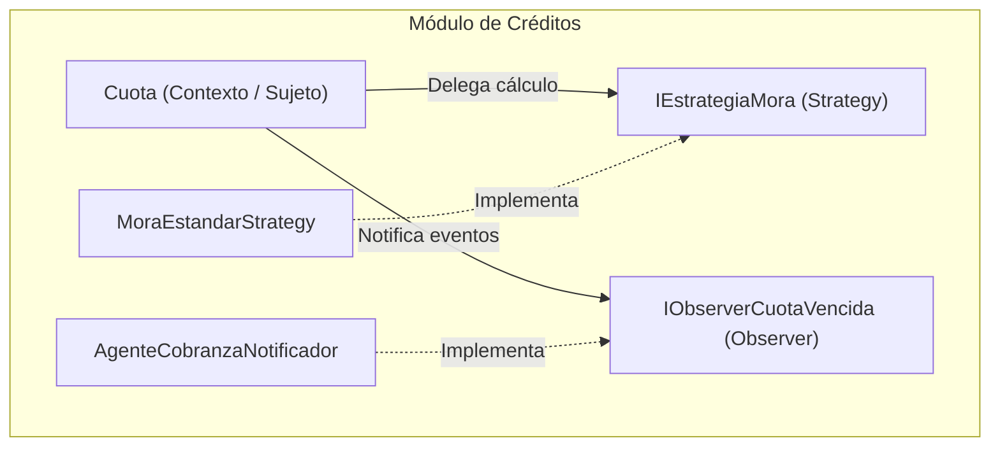

# Módulo de Créditos - Arquitectura de Software y Patrones de Diseño

Este repositorio contiene la implementación práctica, refactorización orientada a principios **SOLID** (`LSP`, `ISP`) y la fusión de patrones avanzados (**Strategy** + **Observer**) aplicada al dominio financiero de **Créditos** (`Cuota`, `Vendedor`, `AgenteCobranza`, `Gerente`).

---

## 📂 Estructura del Repositorio

```text
/
├── lsp/
│   ├── antes.cs             # Violación de LSP (CuotaCondonada lanza NotSupportedException)
│   └── despues.cs           # Solución con contrato honesto e interfaz IConMora
├── isp/
│   ├── antes.cs             # Violación de ISP (Interfaz gorda IEmpleadoCredito)
│   └── despues.cs           # Solución con interfaces segregadas por rol
├── final/
│   └── fusion.cs            # Fusión de Patrones: Strategy + Observer
└── docs/
    └── adr-001.md           # Architecture Decision Record de la fusión
```

---

## 🛠️ Principios y Patrones Aplicados

1. **LSP (Liskov Substitution Principle):** Se asegura que las clases hijas cumplan estrictamente los contratos del padre sin romper expectativas mediante excepciones.
2. **ISP (Interface Segregation Principle):** Se evita que los roles (como el `Vendedor` o `AgenteCobranza`) implementen métodos que no les corresponden.
3. **Fusión de Patrones (Strategy + Observer):**
   * **Strategy:** Permite intercambiar dinámicamente las reglas y algoritmos de cálculo de mora.
   * **Observer:** Permite notificar de forma reactiva y desacoplada a los observadores (ej. `AgenteCobranzaNotificador`) cuando una cuota vence.

---

## 📐 Diagrama Arquitectónico (C4 / Mermaid)



---

## 📄 ADR (Architecture Decision Record)

### ADR-001: Fusión de Strategy y Observer en el Subsistema de Créditos
* **Estado:** Aceptado
* **Contexto:** Se requiere flexibilidad para cambiar algoritmos de mora dinámicamente y notificar de manera reactiva a los roles de la financiera ante vencimientos.
* **Decisión:** Implementar la combinación de *Strategy* para los cálculos y *Observer* para la gestión de eventos de cuotas vencidas.
* **Consecuencias:** Mayor extensibilidad, código limpio y desacoplado, con un incremento controlado en la complejidad estructural inicial.
